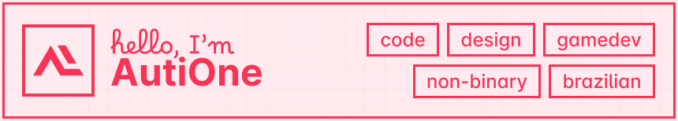

### 👋 heyo, welcome to my github profile

this is where you'll find most of my programming portfolio, some of them in public repos for all to see.

### 📄 get to know more about me

you can visit my website for more information, or to check out my other work available elsewhere. if you want to get in touch, use the buttons above or send me an e-mail!

###### 🎨 this README was designed and written with real human effort, no AI :)
